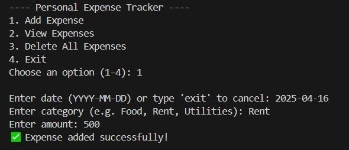
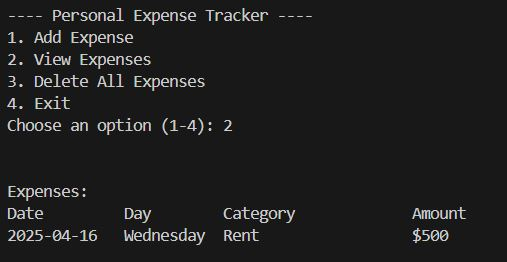
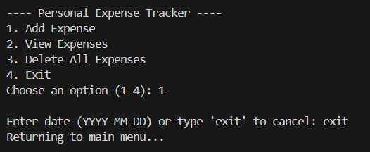

# 💰 Personal Expense Tracker (Python)

A beginner-friendly command-line app to record and manage your daily expenses.

## 📌 Features

- Add a new expense (date, category, amount)
- View all recorded expenses
- Delete all expense records

## 📸 Snapshots





## 🗃 Sample Data (`expenses.csv`)

```csv
2025-04-16,Food,12.50
2025-04-16,Rent,800